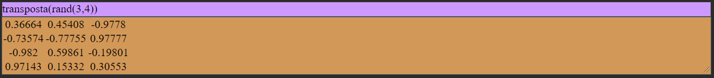

 

  

  <h3 align="center">eguamat</h3>

  

    Ferramenta de programação matemática.
     
    <a href="https://egua.tech/docs"><strong>Documentação »</strong></a>
     
     
    <a href="https://egua.tech/eguamat/">IDEgua</a>
    ·
    <a href="https://github.com/eguatech/eguamat/issues">Reportar Bug</a>
    ·
    <a href="https://github.com/eguatech/eguamat/issues">Solicitar Funcionalidade</a>
     
     
    
    
    
    
     
  

# eguamat

O MatEgua, módulo originado a partir da linguagem Egua, é um instrumento para aplicações matemáticas e científicas. Essa ferramenta apresenta funções indispensáveis para a análise de dados e métodos para modelagem de fenômenos físicos.

## ajuda()
Este comando mostra todas as 45 funções disponiveis no editor, são elas: 

## exemplo() 
Retorna lista de exemplos com algumas das funções. Está função limpará tudo o que foi inserido anteriormente.

# Funções 1 e 2 grau

## fun1(a,b)
Retorna uma lista com valores assumidos por X em dado momento da função.

## fun1R(a,b)
Retorna o valor de X que faz com que F(X) seja 0.

## linspace(Valor Inicial, Valor Final, Quantidade de elementos no vetor)
Retorna números espaçados uniformemente em um intervalo especificado.

## fun2(a,b,c)
Retorna o gráfico da função de segundo grau

## fun2R(a,b,c)
Retorna os valores de X que fazem com que F(X) seja 0.

## rand(n1,n2,e) 
Retorna uma matriz com dimensões n1 e n2 e com números aleatórios e valor esperado e.

## aprox(x,z) 
Aproxima um número, de um vetor ou uma matriz bidimensional de x a z casas decimais.

## matrizn(z) 
Retorna uma matriz javascript dos parâmetros da função z.

## pale(n) 
Retorna um vetor com comprimento n com uma caminhada aleatória pura.

## vet(a,b) 
Retorna um vetor com dados de a até b.

## qtd(a,b) 
Conta o número de elementos b na matriz a. Se o parâmetro b não for especificado, a contagem de a é retornada.

## plot(z)
Retorna um gráfico de um vetor z.

## limpar()
Retorna um espaço de trabalho limpo.

## salvar(x)
onde x é um nome de um arquivo que termina com .html que salva uma cópia do trabalho atual localmente.

## carregar()
Carrega um arquivo .html de uma sessão anteriormente salva.

# Estatística

## max(a)
Retorna o valor máximo de uma matriz a.

## min(a)
Retorna o valor mínimo de uma matriz a.

## intervalo(a)
Calcula o intervalo (max - min) de uma matriz a.

## mediana(a)
Calcula a mediana de uma matriz a.

## smtr(a)
Calcula a soma de determinada matriz a.

## media(a)
Calcula o valor média de uma matriz a.

## ve(a)
Calcula o valor esperado (média aritmética) de uma matriz a. 

## sqr(array)
Calcula a soma dos quadrados dos resíduos (sqr) de uma matriz a.

## variancia(array, flag)
Calcula a variação de uma matriz. Se flag = 0 então é uma população. Se flag = 1 então é uma amostra.

## devpad(array, flag)
Calcula o desvio padrão de uma matriz. Se flag = 0 então é uma população. Se flag = 1 então é uma amostra.

## covar(array1, array2)
Calcula a covariância de duas matrizes.

## coefvar(array)
Calcula o coeficiente de variação para uma matriz.

## coefcorr(array1, array2)
Calcula o coeficiente de correlação de pearson para duas matrizes.

# Matrizes

## coluna(a,c)
Retorna uma coluna específica c de uma matriz bidimensional a.

## linha(a,r)
Retorna uma coluna específica c de uma matriz bidimensional a.

## transposta(a)
Retorna a transposta de linhas de um vetor, uma coluna de um vetor ou uma matriz bidimensional. 

## matriz(z)
Cria e exibe uma tabela a partir de um vetor ou de uma matriz bidimensional z.

## matrizmult(a,b)
Multiplica duas matrizes a e b.

## matrizinv(m)
Calcula o inverso da matriz m a partir da eliminação gaussiana.

## matrizid(n)
Retorna uma matriz de identidade com n números de linhas e colunas. 

# Trigonometria

## sen(x) 
Retorna o seno de um número X em radiano.

## cos(x)
Retorna o cosseno de um número X em radiano.

## tan(x) 
Retorna a tangente de um número X em radiano.

## arcos(x)
Retorna o arco cosseno de um número X em radiano.

## arsen(x)
Retorna o arco tangente de um número X em radiano.

## artan(x)
Retorna o arco tangente de um número X em radiano.

## exp(x)
Retorna e^x, onde x é o argumento, e é a Constante de Euler, a base dos logaritmos naturais.

## log(x)
Retorna o logaritmo natural (base e) de um número X.

## pot(x,y)
Retorna a potenciação de um número base X por uma expoente Y, também podendo ser aplicada para realização de uma radiciação.

## aleat()
Retorna um número pseudo-aleatório no intervalo [0, 1].

## raizq(x) 
Retorna a raíz quadrada de um número X.

Observe que uma entrada que termina com: oculta a visualização da saída.

Observe que uma entrada que começa com # é definida como texto. 

# Cinemática
## vmed(distância,tempo)
Retorna o valor da velocidade média a partir dos valores de entrada da distância e tempo, respectivamente.

   

## deltas(espaço inicial, espaço final)
Retorna o espaço percorrido baseado na diferença do Espaço Final pelo Espaço Inicial.
O cálculo é feito como ilustrado abaixo.

## deltat(tempo inicial, tempo final)
Retorna o tempo percorrido baseado na diferença do Tempo Final pelo Tempo Inicial.
O cálculo é feito como ilustrado abaixo.

## acel(Velocidade Final, Velocidade Inical, Tempo Final, Tempo Inicial)
Retorna o valor da aceleração utilizando como dados de entrada os valores da Velocidade Final, Velocidade Inicial, Tempo Final e Tempo Inicial, respectivamente.
A aceleração é obtida a partir da divisão da diferença das velocidades final e inicial, sobre a difença dos tempos final e inicial, como ilustrado abaixo.

## mrufh(Posição Inicial, Velocidade Final, Tempo)
Função Horária do Movimento Retilíneo Uniforme, retorna o valor da posição de um objeto em movimento retilíneo uniforme em um dado instante de tempo.
A posição em dado instante é obtida a partir dos dados de entrada Posição Inicial, Velocidade e Tempo Percorrido, respectivamente.
No EguaMat, esta função gera uma lista com os valores de cada posição em seu respectivo instante no tempo até chegar no instante final que é o valor de tempo inserido na entrada.

## mrufhp(Posição Inicial, Velocidade Final, Tempo)
Função Gráfica para a Função Horária da Posição em Movimento Retilíneo Uniforme.

## mruvel(Posição Inicial, Posição Final, Tempo)
Função Gráfica para velocidade em Movimento Retilíneo Uniforme.

## mruvfh(Posição Inicial, Velocidade Inicial, Tempo, Aceleração)
Função Horária da Posição em Movimento Retilíneo Uniformemente Variado

## mruvfhp(Posição Inicial, Velocidade Inicial, Tempo, Aceleração)
Função Gráfica para Posição em Movimento Retilíneo Uniformemente Variado.

## mruvvel(Posição Inicial, Posição Final, Aceleração)
Função Gráfica para velocidade em Movimento Retilíneo Uniformemente Variado.

# Controle e Servomecanismos

## pid(Overshoot, Tempo de Assentamento, Ganho Estático, Constante de tempo 1, Constante de Tempo 2)
Função para o cálculo dos valores de um controlador PID. 
Para o projeto de um controlador PID deve-se estabelecer alguns valores de entrada na seguinte ordem:
1º - Overshoot: Também conhecido como "sobresinal", é quando um sinal excede o seu valor alvo, esse parâmetro de entrada serve para delimitar (em porcentagem) o limite de quanto o sinal pode ultrapassar seu alvo.
2º - Tempo de Assentamento: Refere-se ao tempo necessário para o sinal partir de um instante inicial, em uma entrada do tipo degrau, até atingir uma faixa tolerável onde considera-se que o sistema está estável. O valor inserido na função representa o tempo desejado para que o sinal se estabilize.
3º - Ganho Estático: Representa o ganho do sinal de saída em relação ao sinal de entrada, o valor inserido na função representa o ganho aplicado ao sistema.
4º - Constante de Tempo 1: Refere-se ao valor da constante de tempo do primeiro polo.
5º - Constante de Tempo 2: Refere-se ao valor da constante de tempo do segundo polo.

## exemplo()
A função exemplo() retorna amostras do uso de todas as funções existentes e a combinação entre elas. 
O exemplo-8 mostra uma demostração de uma matriz transposta:

No exemplo-12 ocorre a plotagem dos valores de uma linha de matriz aleatória;
    
    Exemplo 12: plot(linha(rand(10,5),2))
        rand(10,5) cria uma matriz aleatória X de 10 linha e 5 colunas;
        linha(X,2) retornar a segunda linha da matriz X;
        plot(linha(X,2)), neste exemplo, realiza a plotagem de um gráfico com os valores da linha da matriz X.

